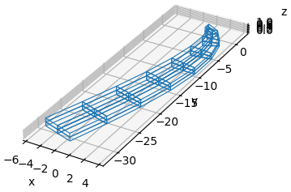
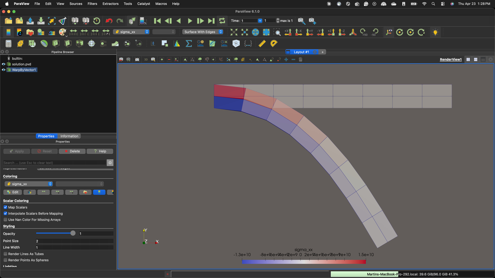

# finite_strain_fem

A small nonlinear finite-element solver: hex8 elements, St. Venant-Kirchhoff material, 2×2×2 Gauss quadrature, Newton-Raphson with load control in the spatial formulation.

## Run

From the repository root, run:

```bash
python -m finite_strain_fem
```

The defaults solve a cantilever beam (L=10, 8×2×2 hex8, E=200e9, ν=0.45, tip load −1e9). The most useful options are:

| option | meaning |
|---|---|
| `--load` | total tip load in −y (N) |
| `--steps` | number of proportional load increments |
| `--nx --ny --nz` | mesh resolution |
| `--tol-r --tol-u` | relative tolerances on residual and Newton increment |
| `--no-plot` | skip the matplotlib wireframe |

Full list: `python -m finite_strain_fem --help`.

## Output

At the end of the run, a matplotlib wireframe shows the deformed mesh:



Every converged load step also writes a `.vtu` file, collected into `paraview_output/solution.pvd` for time-series viewing in ParaView. Per-element fields: `sigma_xx`, `sigma_yy`, `sigma_zz`, `sigma_xy`, `sigma_yz`, `sigma_xz`, `vonMises`. Per-node field: `Displacement`.

Open the PVD in ParaView, apply the **Warp By Vector** filter with `Displacement` to move the nodes to their deformed positions, then color by any stress component:

